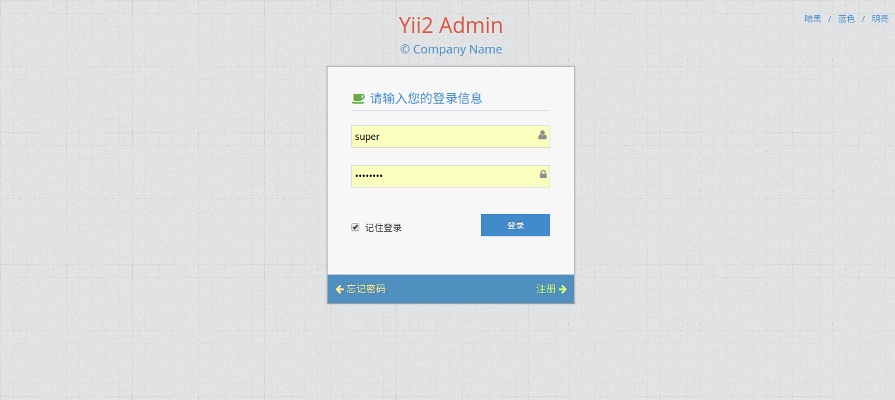
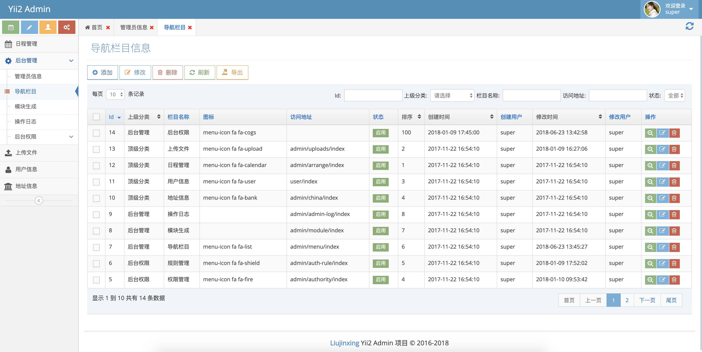

Yii2 Ace Admin Background extension
===================================

 
[](https://packagist.org/packages/jinxing/yii2-admin)
[](https://packagist.org/packages/jinxing/yii2-admin)
[](https://packagist.org/packages/jinxing/yii2-admin)
[](https://github.com/myloveGy/yii2-admin/issues)
[](https://github.com/myloveGy/yii2-admin/network)
[](https://github.com/myloveGy/yii2-admin/stargazers)
[](https://github.com/myloveGy/yii2-admin/blob/master/LICENSE.md)

Extensions developed for yii2, ace admin for background templates. For general background development, it is more convenient; CURL operations for data tables are encapsulated, and all operations have permission control

## Features
* Use RBAC rights management, all operations based on privilege control
* View using JS control, data display using jquery.DataTables
* Based on the data table add, delete, change, check have package, add new data table operation is convenient
## Installation requirements
* PHP >= 5.4
* MySQL

## Installation

The preferred way to install this extension is through [composer](http://getcomposer.org/download/).

Either run
```
composer require jinxing/yii2-admin
```
## Version update instructions

[Version update instructions](./CHANGELOG.md)

Basic Configuration
-------------------

Once the extension is installed, simply modify your application configuration as follows:

```php
return [
    'modules' => [
        'admin' => [
            'class' => 'jinxing\admin\Module',
            
            // Make use of that kind of user
            'user' => 'admin',
            
            // Do not verify permissions
            'verifyAuthority' => false,
            ...
        ]
        ...
    ],
    ...
    'components' => [
        // Front desk user
        'user' => [
            'identityClass'   => 'app\models\User',
            'enableAutoLogin' => true,
        ],
        
        // Background user
        'admin' => [
            'class' => '\yii\web\User',
            'identityClass' => 'jinxing\admin\models\Admin',
            'enableAutoLogin' => true,
            'loginUrl' => ['/admin/default/login'],
            'idParam' => '_adminId',
            'identityCookie' => ['name' => '_admin','httpOnly' => true],
        ],
        
        // This step is not necessary, but you use it outside the module. The controller, view in the module must be added!
        'i18n' => [
            'translations' => [
                'admin' => [
                    'class'          => 'yii\i18n\PhpMessageSource',
                    'sourceLanguage' => 'en',
                    'basePath'       => '@jinxing/admin/messages'
                ],
            ],
        ],
                
    ]
];
```

There are also some param configuration, not mandatory, with default values

```php
// Need to configure params.php
return [
    // Background prefix, used to import data, the prefix of the permission name; currently there is no good solution, all use this configuration item
    'admin_rule_prefix' => 'admin', 
    
     // Login navigation menu cache time
    'cacheTime'         => 86400,    
    
    // Universal status                       
    'status'            => ['停用', '启用'],
    
    // Show other information
    'project_open_other' => false,
               
    'projectName'       => 'Yii2 后台管理系统',              
    'projectTitle'      => 'Yii2 后台管理系统',
    'companyName'       => '<span class="blue bolder"> Liujinxing </span> Yii2 Admin 项目 &copy; 2016-2018',  
];
```

About the configuration of permissions
------------------------------------------
```php
return [
    'components' => [
        'modules' => [
            'admin' => [
                'class' => 'jinxing\admin\Module',
                
                // Make use of that kind of user
                'user' => 'admin'
                ...
            ]
            ...
        ],
        // authority management
        'authManager'  => [
            'class' => 'yii\rbac\DbManager',
        ],
        ...
    ],
]
```

## Import permission information table structure
```
php yii migrate --migrationPath=@yii/rbac/migrations
```

## Importing data information such as table structure and permission configuration required in the background
```
php yii migrate --migrationPath=@jinxing/admin/migrations
```

### Now you can preview your background
### Default super administrator: super
### Default super administrator password: admin123
> Default administrator: admin 
Default administrator password: admin888
```
// Login address
http://localhost/path/to?index.php?r=admin/default/login
```

## Documentation

Please refer to our extensive [Module configuration description](https://github.com/myloveGy/yii2-admin/wiki/2.Module-configuration) for more information.

## Routing permission control description

Basic operation permissions (take administrators as an example)：

* admin/index       (Display Administrator Page + Left Navigation Display)
* admin/search      (Administrator data display form data display)
* admin/create      (Add administrator information)
* admin/update      (Modify administrator information)
* admin/delete      (Delete administrator information)
* admin/delete-all  (Batch delete administrator data)
* admin/upload      (Upload an administrator picture)
* admin/export      (Administrator data information export)

Each request corresponds to a permission, the request path is the name of the permission, and the permission validation is verified in the beforeAction method in the Module

## Preview
1. Login page

2. Data Display


3. Rights allocation

4. Module generation
